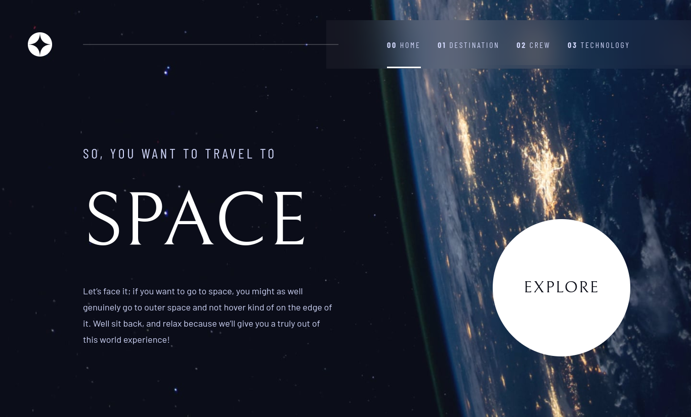

# Frontend Mentor - Space tourism website solution

This is a solution to the [Space tourism website challenge on Frontend Mentor](https://www.frontendmentor.io/challenges/space-tourism-multipage-website-gRWj1URZ3). Frontend Mentor challenges help you improve your coding skills by building realistic projects. 

## Table of contents

- [Overview](#overview)
  - [The challenge](#the-challenge)
  - [Screenshot](#screenshot)
  - [Links](#links)
- [My process](#my-process)
  - [Built with](#built-with)
  - [Continued development](#continued-development)
  - [Useful resources](#useful-resources)
- [Author](#author)

## Overview

### The challenge

Users should be able to:

- View the optimal layout for each of the website's pages depending on their device's screen size
- See hover states for all interactive elements on the page
- View each page and be able to toggle between the tabs to see new information

### Screenshot



### Links

- Solution URL: [https://github.com/J-e-s-se/space-tourism-website]
- Live Site URL: [https://stark-thicket-79261.herokuapp.com/]

## My process

### Built with

- Semantic HTML5 markup
- CSS
- Javascript
- Flexbox
- Mobile-first workflow
- [React](https://reactjs.org/) - JS library
- [Styled Components](https://styled-components.com/) - For styles
- [Scss](https:sass-lang.com/) - For styles

### Continued development
Redux
Typescript

### Useful resources

- [greggod](https://greggod.medium.com/css-do-not-put-height-100-on-the-body-html-e36bda3551b3) - This article helped me understand that 
```css
html, body {
  height: 100%;
}
``` 

sets the body height to 100% of the window height and not the content height.
- [fullstackopen](https://fullstackopen.com/en/) - I'm currently in doing part3 of this course.

## Author

- Frontend Mentor - [@J-e-s-se](https://www.frontendmentor.io/profile/J-e-s-se)